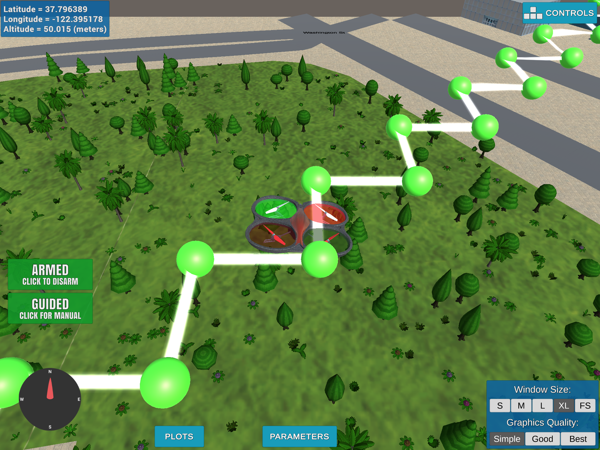
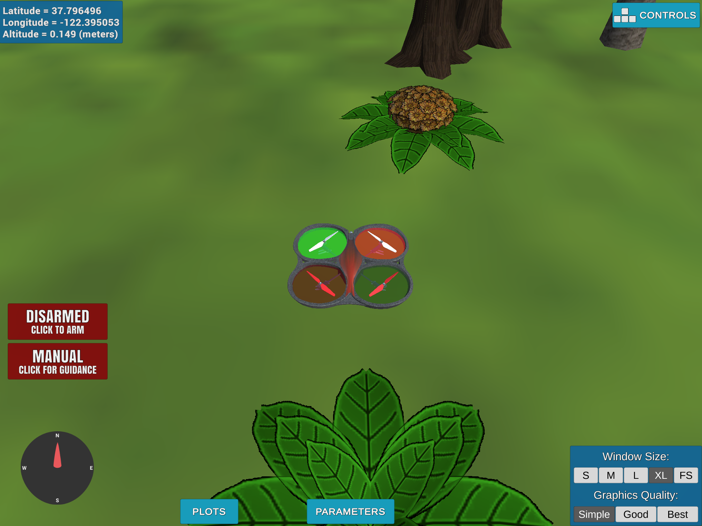

# Drone Planner

## Step 1. Simulator

Download the simulator at the [release page](https://github.com/udacity/FCND-Simulator-Releases/releases),
once downloaded, double click to open the simulator that is look like


## Step 2. Environment

Install miniconda.

```
# download miniconda at https://conda.io/miniconda.html
$ bash ./Miniconda3-latest-MacOSX-x86_64.sh
$ export PATH=/Users/<username>/miniconda3/bin:$PATH
```

Create an environment yaml file ``environment.yml``:

```
name: drone-planner
channels:
    - conda-forge
dependencies:
    - python==3.6.3
    - matplotlib==2.1.1
    - jupyter==1.0.0
    - future==0.16.0
    - lxml==4.1.1
    - networkx==2.1
    - scikit-image==0.13.1
    - scipy==1.0.0
    - shapely==1.6.4
    - scikit-learn==0.19.1
    - pip:
        - git+https://github.com/udacity/udacidrone.git
        - visdom==0.1.7
        - bresenham==0.2
        - msgpack==0.5.6
```

Download the dependencies as defined in the yaml file.

```
$ conda env create -f environment.yml
# useful commands:
# source activate drone-planner
# source deactivate
# conda env remove -n drone-planner
# conda info --envs
# conda clean -tp
```

Once Finished, it would look like


## Step 3. Repository

Clone the repository to the local destination.

```
$ git clone https://github.com/udacity/FCND-Motion-Planning
```

Integrated into the project with some modifications as below:


## Step 4. Verification

Activate the environement created at step 2, and run the ``backyard_flyer_solution.py``
to test the setup.

```
$ source activate drone-planner
$ python backyard_flyer_solution.py
Logs/TLog.txt
Logs/NavLog.txt
starting connection
arming transition
takeoff transition
Setting Home
waypoint transition
target position [10.0, 0.0, 3.0]
waypoint transition
target position [10.0, 10.0, 3.0]
waypoint transition
target position [0.0, 10.0, 3.0]
waypoint transition
target position [0.0, 0.0, 3.0]
landing transition
disarm transition
manual transition
Closing connection ...
```

As expected, the quadcopter take off, fly a square rule and land.


## Step 5. Inspection

Inspect the relevant files:

```
Relevant files:
- motion_planning.py          # the motion planning script, student task in plan_path()
- planning_utils.py           # the functions of planning utilities
- colliders.csv               # the data of 2.5D map
```

## Step 6. Motion

In ``backyard_flyer_solution.py`` and ``motion_planning.py``, the process of the missions is
the same as

```
arm -> takeoff -> transition -> landing -> disarm -> manual
```

However, the drone flies a box path at the backyard, while a jerky route in the city, is because
the waypoints setup as a box (function ``calculate_box()``) in the ``backyard_flyer_solution.py``,
while as a jerky path (function ``plan_path()``) in the ``motion_planning.py``. The waypoints
define what kind of the path the drone would fly.

### How motion planning works

Let's detail the steps in ``plan_path()``:

- Step 1. Update the ``flight_state`` as ``PLANNING``, and print out ``Searching for a path ...`` on
the console;
- Step 2. Initialize the target position: ``TARGET_ALTITUDE``, ``SAFETY_DISTANCE``, ``self.target_position[2]``;
- Step 3. Print out the initialized positions: ``global_home``, ``global_position``, ``local_position``;
- Step 4. Read the waypoints from ``colliders.csv`` by skipping the first two rows;
- Step 5. Create a grid representation of a 2D configuration space by calling the function ``create_grid()``,
and extract the ``north_offset`` and ``east_offset`` values, then print them out on the console;
- Step 6. Setup the ``grid_start`` and ``grid_goal`` by the ``north_offset`` and ``east_offset``;
- Step 7. Generate a path from A\* search by the extracted grid, start position, goal position and heuristic
function using the function ``a_star()`` and ``heuristic()``;
- Step 8. Extract waypoints from a given path at step 7 and assign back to ``self.waypoints``;
- Step 9. Send the waypoints back by ``self.send_waypoints()``.


### Key function descriptions

Key steps in ``motion_planning.py``:

```
# initialize the drone that contains the values:
# - target_position: numpy array, default value [0.0, 0.0, 0.0];
# - waypoints: a list, default value [];
# - in_mission: boolean, default value true;
# - check_state: a dictionary, default value {};
# - flight_state: an enum class of states, default value States.MANUAL
# - register_callback(): the callback functions of the events, here are local position,
# local velocity and state, the events would be responded to the state updated correspondingly.
drone = MotionPlanning()

# update the flying path
drone.plan_path()
```

Functions provided in ``planning_utils.py``:

- ``create_grid()``: creates a grid representation of a 2D configuration space based on given
obstacle data, drone altitude and safety distance;
- ``a_star()``: A* algorithm for searching the path;
    - ``heuristic()``: the heursitic function;
    - ``valid_actions()``: a list of valid actions based on a given grid and current node;
        - ``Action()``: the action of the directions west, east, north and south that contains the
value of the current grid position and its cost.


### Simulation

Run the script ``motion_planning.py``:

```
$ source activate drone-planner
$ python motion_planning.py
```

The console shows the logs:

```
Logs/TLog.txt
Logs/NavLog.txt
starting connection
arming transition
Searching for a path ...
global home [-122.39745   37.79248    0.     ], position [-122.3974516   37.7924789    0.156    ], local position [-0.11443461 -0.1506926  -0.1565406 ]
North offset = -316, east offset = -445
Local Start and Goal:  (316, 445) (326, 455)
Found a path.
Sending waypoints to simulator ...
takeoff transition
waypoint transition
target position [0, 0, 5, 0]
waypoint transition
target position [0, 1, 5, 0]
waypoint transition
target position [1, 1, 5, 0]
waypoint transition
target position [1, 2, 5, 0]
waypoint transition
target position [2, 2, 5, 0]
waypoint transition
target position [2, 3, 5, 0]
waypoint transition
target position [3, 3, 5, 0]
waypoint transition
target position [3, 4, 5, 0]
waypoint transition
target position [4, 4, 5, 0]
waypoint transition
target position [4, 5, 5, 0]
waypoint transition
target position [5, 5, 5, 0]
waypoint transition
target position [5, 6, 5, 0]
waypoint transition
target position [6, 6, 5, 0]
waypoint transition
target position [6, 7, 5, 0]
waypoint transition
target position [7, 7, 5, 0]
waypoint transition
target position [7, 8, 5, 0]
waypoint transition
target position [8, 8, 5, 0]
waypoint transition
target position [8, 9, 5, 0]
waypoint transition
target position [9, 9, 5, 0]
waypoint transition
target position [9, 10, 5, 0]
waypoint transition
target position [10, 10, 5, 0]
landing transition
disarm transition
manual transition
Closing connection ...
```

Therefore, at the current case, 21 waypoints are extracted from the path searching from a given grid,
start position and goal position using heuristic function. The quadcopter flies a jerky path of these
waypoints to the northeast for about 10m then land.


## Step 7. Planner

Implemented the path planing using A\* search algorithm with heuristic function, and then prune the path
with a collinearity test, then motion planing done!

Codes implemented in ``plan_path()``:

```
    def plan_path(self):
        self.flight_state = States.PLANNING
        print("Searching for a path ...")
        # target: [goal_lat, goal_lon, target_alt]
        target = open('target.csv', 'r').readline().strip().split(',')
        TARGET_GLOBAL = [float(target[0]), float(target[1]), int(target[2])]
        TARGET_ALTITUDE = TARGET_GLOBAL[2]
        SAFETY_DISTANCE = 5

        self.target_position[2] = TARGET_ALTITUDE

        # TODO: read lat0, lon0 from colliders into floating point values
        lat0, lon0 = open('colliders.csv', 'r').readline().strip().split(',')
        lat0 = float(lat0[5:])
        lon0 = float(lon0[6:])

        # TODO: set home position to (lon0, lat0, 0)
        self.set_home_position(lon0, lat0, 0)

        # TODO: retrieve current global position
        current_position_global = [self._longitude, self._latitude, self._altitude]

        # TODO: convert to current local position using global_to_local()
        current_position_local = global_to_local(current_position_global, self.global_home)

        print('global home {0}, position {1}, local position {2}'.format(self.global_home, self.global_position,
                                                                         self.local_position))
        # Read in obstacle map
        data = np.loadtxt('colliders.csv', delimiter=',', dtype='Float64', skiprows=2)

        # Define a grid for a particular altitude and safety margin around obstacles
        grid, north_offset, east_offset = create_grid(data, TARGET_ALTITUDE, SAFETY_DISTANCE)
        print("North offset = {0}, east offset = {1}".format(north_offset, east_offset))
        # Define starting point on the grid (this is just grid center)
        grid_start = (-north_offset, -east_offset)
        # TODO: convert start position to current position rather than map center
        grid_start = (int(current_position_local[0] - north_offset), int(current_position_local[1] - east_offset))

        # Set goal as some arbitrary position on the grid
        grid_goal = (-north_offset + 10, -east_offset + 10)
        # TODO: adapt to set goal as latitude / longitude position and convert
        goal_position_global = [TARGET_GLOBAL[1], TARGET_GLOBAL[0], self._altitude]
        goal_position_local = global_to_local(goal_position_global, self.global_home)
        grid_goal = (int(goal_position_local[0] - north_offset), int(goal_position_local[1] - east_offset))

        # Run A* to find a path from start to goal
        # TODO: add diagonal motions with a cost of sqrt(2) to your A* implementation
        # or move to a different search space such as a graph (not done here)
        print('Local Start and Goal: ', grid_start, grid_goal)
        path, _ = a_star(grid, heuristic, grid_start, grid_goal)
        # TODO: prune path to minimize number of waypoints
        # TODO (if you're feeling ambitious): Try a different approach altogether!
        path = prune_path(path)

        # Convert path to waypoints
        waypoints = [[p[0] + north_offset, p[1] + east_offset, TARGET_ALTITUDE, 0] for p in path]
        # Set self.waypoints
        self.waypoints = waypoints
        # TODO: send waypoints to sim (this is just for visualization of waypoints)
        self.send_waypoints()
```

``prune_path()`` and ``collinearity_check`` in ``planning_utils.py``:

```
def point(p):
    return np.array([p[0], p[1], 1.]).reshape(1, -1)


def collinearity_check(p1, p2, p3, epsilon=1e-6):
    m = np.concatenate((p1, p2, p3), 0)
    det = np.linalg.det(m)
    return abs(det) < epsilon


def prune_path(path):
    i = 0
    pruned_path = [p for p in path]
    while i < (len(pruned_path) - 2):
        if collinearity_check(point(pruned_path[i]), point(pruned_path[i+1]), point(pruned_path[i+2])):
            pruned_path.remove(pruned_path[i+1])
        else:
            i += 1
    return pruned_path
```

Target altitude and the latitude and longitude for goal position in ``target.csv``:

```
# goal_latitude, goal_longitude, target_altitude
37.796490,-122.39499,50
```

Please note that tune the last three digits of the goal latitude and longitude if a new target position
is desired; keep the high altitude would be helpful for searching for a path, but it is a trade-off to
get a valid path and have a visible city landscape.

Open the simulator and run ``python motion_planning.py``, it works!



